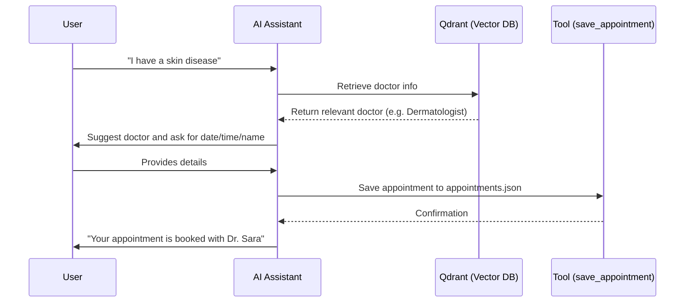

# 🏥 AI-Powered Doctor Appointment Assistant

An **AI-powered assistant** that helps doctors streamline appointment bookings and improve the overall patient experience.

This repo demonstrates practical use of **LangChain, FastAPI, Qdrant, Retrieval-Augmented Generation (RAG), conversational memory, and custom tool integrations**.

---

## ✨ Features

✅ Patients can **ask for a doctor** or **describe their disease** naturally.
✅ **RAG-based retrieval** of doctor info from **Qdrant**.
✅ Maintains **chat history** for contextual conversations.
✅ Uses **LangChain tools** to save appointments.
✅ Appointments stored in **JSON file** (easily replaceable with DB).

---

## 🖼️ Demo Flow

1. User sends a query: *"I have a skin disease."*  
2. Assistant processes the query through the **LLM (Gemini via LangGraph)**.  
3. **Tool calling** is triggered:
   - **Qdrant Vector Store** → retrieves the most relevant doctor based on embeddings.  
   - **Appointment Tool** → handles date, time, and patient information.  
4. **Chat history is appended** and preserved across turns, so the assistant remembers context during the session.  
5. The assistant orchestrates the tools and combines results into a natural response.  
6. Data persistence:
   - For now, appointments are saved in **appointments.json**.  
   - Future plan: replace with **PostgreSQL + checkpointer** for persistent history.  

---


## 🔄 System Flow Diagram



---

## 🛠️ Tech Stack

* [LangChain](https://www.langchain.com/) → LLM orchestration
* [FastAPI](https://fastapi.tiangolo.com/) → API layer
* [Qdrant](https://qdrant.tech/) → Vector DB for RAG
* [Uvicorn](https://www.uvicorn.org/) → ASGI server
* JSON Tool → Appointment storage

---

## ⚙️ Setup & Run

### 🚀 One-Command Setup (Recommended)

The easiest way to get started! Our comprehensive setup script handles everything automatically:

```bash
# Clone and enter the repository
git clone https://github.com/your-username/ai-doctor-assistant.git
cd ai-doctor-assistant

# Run the automated setup (handles everything!)
python setup.py
```

**What the setup script does:**
✅ Creates virtual environment (if needed)
✅ Installs all Python dependencies
✅ Configures environment variables (.env file)
✅ Tests API connections (Google, Qdrant, Cohere)
✅ Populates vector database with doctors
✅ Verifies everything works correctly

### 🔧 Manual Setup (Alternative)

If you prefer manual setup:

#### 1️⃣ Clone Repository
```bash
git clone https://github.com/your-username/ai-doctor-assistant.git
cd ai-doctor-assistant
```

#### 2️⃣ Setup Virtual Environment
```bash
python -m venv env
source env/bin/activate   # Linux/Mac
env\Scripts\activate      # Windows
```

#### 3️⃣ Install Dependencies
```bash
pip install -r requirements.txt
```

#### 4️⃣ Configure Environment
Create a `.env` file with your API keys:
```bash
# Copy this to .env and fill in your keys
GOOGLE_API_KEY=your_google_api_key
QDRANT_URL=your_qdrant_url
QDRANT_API_KEY=your_qdrant_api_key
COHERE_API_KEY=your_cohere_api_key
```

#### 5️⃣ Run Setup Script
```bash
python setup.py
```

### 🎯 Start the Application

```bash
python main.py
```

Visit `http://localhost:8000` in your browser!

### 🧪 Test the Assistant


You can quickly test the assistant from the **homepage**.  
Simply type a message (e.g., *“I have a skin disease”*) in the chat box.  


## 🚀 Roadmap

* [ ] Add authentication & role-based access  
* [ ] Deploy with Docker + Nginx + Cloud (AWS/DigitalOcean)
* [ ] Add a doctor registration page and injest data to qdrant
* [ ] Replace JSON file storage with PostgreSQL  
* [ ] Use LangGraph instead of LangChain  
* [ ] Implement PostgreSQL checkpointer for persistent chat history  
* [ ] Add routing to enable document search only when needed
* [ ] Add appointment search to check doctor's availability

---

## 👨‍💻 Author

**Omar Faruk**
📧 [omar.iut.09@gmail.com](mailto:omar.iut.09@gmail.com)
🔗 [LinkedIn](https://linkedin.com/in/omariut)

---

⭐ If you found this project interesting, don’t forget to **star this repo**!
